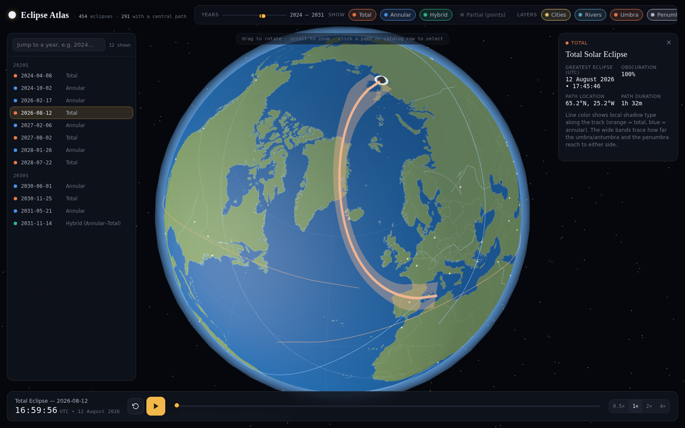

# Solar Eclipse Browser

An interactive 3D globe of every solar eclipse from 1900 to 2100 — total, annular, hybrid, and partial — with animated shadow paths, umbra/penumbra reach bands, and a searchable catalog.

[Solar Eclipse Browser Demo](https://jurgenkobierczynski.com/Solar-Eclipse-Browser/index.html)



## What it does

- Renders a rotating, zoomable Earth (Three.js/WebGL) with accurate country borders, coastlines, a curated set of major world cities, and a dozen iconic rivers.
- Plots the ground track of every total/annular/hybrid solar eclipse from 1900–2100 (454 eclipses total, 291 with a central path), computed from first principles rather than a pre-baked catalog.
- Animates the Moon's shadow moving along the selected eclipse's path in real time, with play/pause, replay, a scrubber, and adjustable speed.
- Draws the umbra/antumbra reach (the narrow band of totality/annularity, tens to a few hundred km wide) and the penumbra reach (the much wider partial-eclipse shadow, typically thousands of km wide) as separate, independently toggleable bands along the path.
- Lights the globe with the real sub-solar point for whichever eclipse instant is selected, so the day/night terminator is astronomically correct.
- Filters by year range and eclipse type, and includes a searchable/sortable catalog panel.

## Running it

This is a static, single-page app — no build step, no server required.

1. Open `index.html` in any modern desktop browser (Chrome, Firefox, Edge, Safari).
2. An internet connection is needed the first time, to load Three.js and the page's fonts from their CDNs (`cdn.jsdelivr.net`, `fonts.googleapis.com`). Everything else — all eclipse and map data — is bundled locally in this folder.

If you'd rather serve it locally instead of opening the file directly (some browsers restrict `fetch()` on `file://` URLs), run a simple static server from this folder, e.g.:

```
python3 -m http.server 8000
```

then visit `http://localhost:8000/`.

## Files

| File | Contents |
|---|---|
| `index.html` | The application: rendering, UI, and animation logic |
| `eclipses.json` | Every eclipse 1900–2100: date, kind, obscuration, and (for total/annular/hybrid) a sampled ground track with per-point umbra and penumbra half-widths |
| `mapdata.json` | Land and country-border vector paths (equirectangular projection), rendered onto the globe's texture |
| `cities.json` | ~70 major world cities (name + coordinates), for orientation when zoomed in |
| `rivers.json` | A dozen major rivers as waypoint polylines |

## Data & methodology

Eclipse geometry is computed directly from the [astronomy-engine](https://github.com/cosinekitty/astronomy) ephemeris library: at each sample time, the Sun and Moon's apparent geocentric positions give the shadow axis, which is intersected with the WGS84 reference ellipsoid to get the shadow's ground point, umbra/antumbra half-width, and penumbra half-width. This was cross-checked against published figures for well-documented real eclipses (e.g. the 2017-08-21 total eclipse) to within about a kilometer.

The cities and rivers layers are hand-curated from general geographic knowledge for visual orientation — they are illustrative reference layers, not an exhaustive or survey-grade geographic dataset.

## License

Licensed under the **GNU General Public License v3.0** (GPL-3.0). See [`LICENSE`](LICENSE) for the full text.

## Author

Claude 5 High
